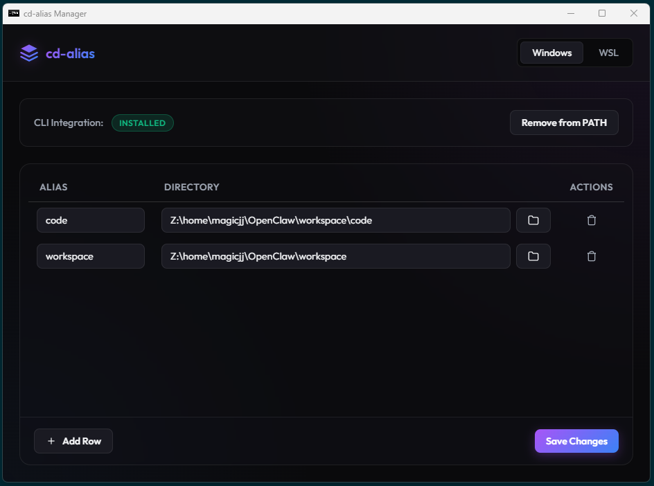

# cd-alias

A desktop GUI utility and CLI helper (`cda`) for creating directory aliases across Windows Command Prompt, PowerShell, and WSL bash terminals. Quickly jump to your project folders from any terminal prompt using custom short aliases, with automatic path resolution and environment synchronization.



---

## Key Features

1. **Cross-Environment Support**: Separate tabs and configurations for **Windows** (CMD & PowerShell) and **WSL** (bash).
2. **Native Directory Jumping**: Executing `cda <alias>` in any terminal directly updates your terminal's current working directory.
3. **Directory Selector & Network Drive Resolution**:
   - Integrated folder browser button per row.
   - Automatically detects Windows mapped network drives (e.g. `Z:`) pointing to WSL network shares and resolves selected paths into native Linux paths (e.g. `/home/user/project`).
4. **Fuzzy Matching & Intelligent CLI Help**:
   - `cda` or `cda --help` outputs standard options alongside all defined aliases.
   - Typing an invalid alias outputs the list of all defined aliases first, followed by top fuzzy match suggestions using Levenshtein distance algorithms.
5. **GUI Single-Instance Focus**:
   - Running `cda --open` or `cda --config` brings the existing GUI window into focus if already open.
6. **Smart Save State & Unsaved Warnings**:
   - The **Save Changes** button displays as white when there are no changes, glowing gradient when changes exist.
   - Warns users if they attempt to close the window with unsaved alias changes.
7. **One-Click PATH Configuration**:
   - Automatically manages PATH environment variables, PowerShell profile functions (`$PROFILE`), and WSL bash profile (`~/.bashrc`).
   - Built-in upgrade protection prevents duplicate PATH additions.

---

## Quick Start Guide

### Prerequisites
Make sure you have Node.js and NPM installed:
- **Node.js**: `v18+` or higher recommended
- **NPM**: `v9+` or higher

### 1. Setup & Installation
Clone the project, navigate to the `cd-alias` directory, and run:
```bash
# Install Electron and packaging dependencies
npm install
```

### 2. Start the App locally
To launch the Electron desktop interface in development mode:
```bash
npm start
```

---

## Packaging & Building Executables

This project uses `electron-builder` to package native desktop binaries. 

To package the application for **Windows**, run:
```bash
npm run dist
```
This command compiles and packages two formats inside the `dist/` folder:
1. **Windows Installer (NSIS)**: An `.exe` installer script (`cd-alias Setup 1.0.0.exe`) that guides users through installing the app on their system.
2. **Portable Executable**: A standalone `.exe` (`cd-alias 1.0.0.exe`) that launches the application immediately without installation.

---

## CLI Usage Summary

```bash
# Jump to an alias
cda work

# Open alias directory directly in File Explorer
cda work -o
cda work --open

# Open the GUI configuration window
cda --gui
cda --config

# List all configured aliases
cda --list

# Display help and alias list
cda --help
```

---

## File Structure

```text
cd-alias/
├── package.json        # Node configuration, dependencies, and build targets
├── LICENSE             # MIT License
├── .gitignore          # Git exclusion rules
├── icon/               # Application icons
│   ├── icon.png
│   └── icon.ico
├── docs/               # Screenshots and documentation
│   └── images/
│       └── cd-alias.png
├── src/                # Front-end and back-end source code
│   ├── main.js         # Electron main process (I/O, single-instance lock, mapped drive resolver)
│   ├── preload.js      # Safe IPC context bridge
│   ├── index.html      # Application markup structure
│   ├── style.css       # Premium glassmorphic dark mode styling
│   ├── renderer.js     # UI event handlers, table management, state tracking
│   └── cda-cli.js      # Core CLI helper script and fuzzy search engine
└── README.md           # Project documentation
```
